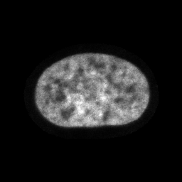
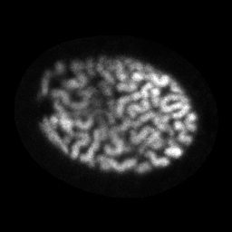
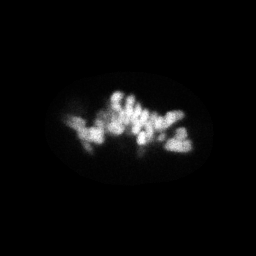
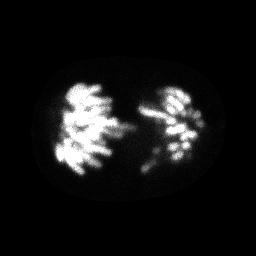
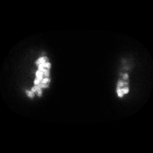

## MNIST autoencoder

### Loss plot

:::{figure} #sfig1a_data
:label: sfig1a
:placeholder: ./figures/sfig1a.png
Autoencoder reconstruction loss over one-hundred epochs of training on the MNIST dataset.
:::

### Reconstructed images

:::{figure} #sfig1b_data
:label: sfig1b
:placeholder: ./figures/sfig1b.png
Original (left) and reconstructed images (right) can be browsed by index and training epoch.
:::

## Cherry-picked images for cross-reference in the text

:::{figure}
:label: cell-cycle-phases

(interphase)=

(prophase)=

(metaphase)=

(anaphase)=

(telophase)=


Cherry-picked images chosen to represent interphase and four stages of mitosis.

:::

```{figure} ./figures/artifact.png
:label: cellpose_artifact
:align: center

An example of a blank image created by cellpose segmentation artifacts.
```

```{figure} ./figures/unreal_interpolation.png
:label: unrealistic_interpolation
:align: center

An example of unrealistic decodings along interpolated latent vectors.
```
